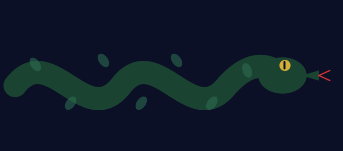

<p align="center">
  
</p>

<p align="center">
  
</p>

<p align="center">
  <a href="https://www.linkedin.com/in/vaishnavidixit6"></a>
  <a href="https://www.kaggle.com/vaishnavidixit6"></a>
  <a href="mailto:vaishnavidixit@mail.adelphi.edu"></a>
</p>


## 🪄 About Me

```python
class VaishnaviDixit:

    role        = "Data Science Graduate Student"
    focus       = "Healthcare AI · Applied Machine Learning"
    mission     = "Use data to make healthcare more predictive, accessible, affordable"

    currently_casting = [
        "Analyzing uncertainty in predictive models",
        "Learning Time Series analysis",
        "Learning Exploring Generative AI",
        "Learning Multivariate analysis",
        "Making Road Infrastructure Project transparent",
    ]

    research_interests = [
        "Healthcare AI",
        "Biomedical Machine Learning",
        "Uncertainty Quantification",
        "Statistical Modeling",
        "Responsible AI",
    ]

    motto = "Predictive. Accessible. Affordable."
```


## 📜 The Spellbook (Projects)

### 🏥 Hospital Readmission Risk Prediction
Predicting readmission risk from clinical data — built on `MIMIC-IV` and served through a `FastAPI` + `React` stack, with `Google BigQuery` powering the data layer underneath.

`Python` `MIMIC-IV` `FastAPI` `React` `Google BigQuery`

---

### 🩺 Healthcare Abuse Detection
Using Social Determinants of Health (SDOH) survey data to help surface potentially unreported abuse cases — an applied ML project aimed at giving vulnerable patients a better safety net.

`Python` `Machine Learning` `SDOH`

---

### 💍 Jewelry E-Commerce Website
A full-stack e-commerce platform built with a focus on a smooth, delightful shopping experience — prototyped and refined through a vibe-engineering workflow.

`React` `FastAPI` `PostgreSQL` `Docker`

---

### 🛣️ Road Infrastructure Analysis *(in progress)*
Mapping India's roads to the contractor responsible, funds allotted, and maintenance status, with a channel for citizens to file complaints.

`Python` `Machine Learning` `Geospatial Analysis`


## 🏆 Trophy Case (Achievements)

| 🏅 | Detail |
|---|---|
| 📝 | Research article under review — *American Statistical Association CHANCE Magazine* |
| 🎤 | Presenter — NCUR 2025 · Northeast Regional Honors Council Conference · Adelphi Scholarship & Creative Works Conference |
| 🥉 | Third Place — Nexus Tantra 2K26 |
| 💻 | Participant — Cornell Health Hackathon |


## ⚡ Wand Core (Tech Stack)

**Languages & Databases**

     

**Web Development**

  

**Analytics & Visualization**

  

**Libraries**

   

**Tools**

  


## 🔮 The Pensieve (GitHub Stats)

<p align="center">
  
  
</p>

<p align="center">
  
</p>

<p align="center">
  
</p>


## 🐍 The Familiar (Contribution Snake)

<p align="center">
  
</p>


## 🦉 Send an Owl (Connect)

Open to conversations, collaboration, and the occasional owl post.

<p align="center">
  <a href="https://www.linkedin.com/in/vaishnavidixit6"></a>
  <a href="https://www.kaggle.com/vaishnavidixit6"></a>
  <a href="mailto:vaishnavidixit@mail.adelphi.edu"></a>
</p>

<p align="center"><i>"A confident model isn't always a correct one."</i></p>